<div align="center">

<a href="https://atawurrahmantanvir.github.io/Mail-Factory/">

</a>

# MAIL FACTORY

### YOUR DIGITAL FREEDOM

**Generate emails. Create strong passwords. Manage & organize — all in one powerful app.**

<a href="https://atawurrahmantanvir.github.io/Mail-Factory/">

</a>

</div>

---

<div align="center">



<sub>Animated product stage using the real application screen assets.</sub>

</div>

---

## THE PRODUCT

Mail Factory is a focused Android utility built around:

<div align="center">

**GENERATE → INSPECT → ORGANIZE → CONTROL**

</div>

The application uses a dark black-and-crimson visual system with glowing controls, animated energy, compact navigation and system-style feedback. fileciteturn1file0L59-L72

---

## APP PREVIEW

<div align="center">

<table border="0">
<tr>
<td align="center"><br><sub><strong>DASHBOARD</strong></sub></td>
<td align="center"><br><sub><strong>ENGINE</strong></sub></td>
<td align="center"><br><sub><strong>GENERATOR</strong></sub></td>
<td align="center"><br><sub><strong>LIBRARY</strong></sub></td>
<td align="center"><br><sub><strong>ONE TOUCH</strong></sub></td>
<td align="center"><br><sub><strong>SETTINGS</strong></sub></td>
</tr>
</table>

</div>

---

## THE 3D EXPERIENCE

The full interactive presentation is **not repeated as a second banner**. The hero banner appears once at the top; the visual below is a separate animated product stage.

<div align="center">

<a href="https://atawurrahmantanvir.github.io/Mail-Factory/">

</a>

</div>

`docs/index.html` is the interactive layer. It is the correct place for full pointer-driven 3D motion, particles, screen transitions and other JavaScript effects. GitHub README rendering sanitizes executable scripts, so the README uses a GitHub-compatible animated SVG presentation instead. citeturn733910search0turn733910search3

---

## EXPLORE THE APP

<details>
<summary><strong>DASHBOARD</strong></summary>

The visual command surface with the factory identity, status and animated hero treatment. The supplied HTML uses energy fields, orbiting elements, a reticle, scan motion and glitch/flicker typography. fileciteturn1file0L337-L398

</details>

<details>
<summary><strong>ENGINE</strong></summary>

A dedicated control surface using the same glowing action language as the rest of the application.

</details>

<details>
<summary><strong>GENERATOR</strong></summary>

Single and batch generation with configurable parameters and direct copy actions. fileciteturn2file8L1-L22

</details>

<details>
<summary><strong>LIBRARY</strong></summary>

Search, sorting and entry management, including row-level copy handling. fileciteturn2file0L1-L25

</details>

<details>
<summary><strong>ONE TOUCH</strong></summary>

A focused rapid-action surface for frequently used operations.

</details>

<details>
<summary><strong>SETTINGS</strong></summary>

Appearance, language, backup, notifications, privacy, support, feedback and application information.

</details>

---

## DESIGN LANGUAGE

<div align="center">

`BLACK DEPTH` · `CRIMSON ENERGY` · `GLASS` · `GLOW` · `MOTION` · `PRECISION`

</div>

The shared utility theme centers on `#030406`, `#EA0C20`, `#FF2438`, dark cards and light system text. fileciteturn1file0L59-L72

---

## REPOSITORY MAP

```text
Mail-Factory/
│
├── app/
│
├── docs/
│   ├── index.html
│   ├── assets/
│   │   ├── hero-banner.png
│   │   ├── logo.png
│   │   └── screens/
│   │       ├── dashboard.png
│   │       ├── engine.png
│   │       ├── generator.png
│   │       ├── library.png
│   │       ├── one-touch.png
│   │       └── settings.png
│   │
│   ├── readme/
│   │   └── showcase.svg
│   │
│   └── source/
│       └── mail-factory.html
│
├── README.md
└── .gitignore
```

---

<div align="center">

**MAIL FACTORY**

`GENERATE` · `ORGANIZE` · `CONTROL`

<br><br>

<a href="https://atawurrahmantanvir.github.io/Mail-Factory/">

</a>

</div>
