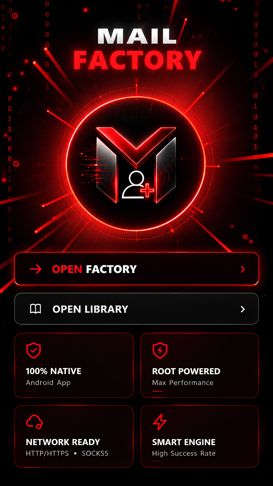
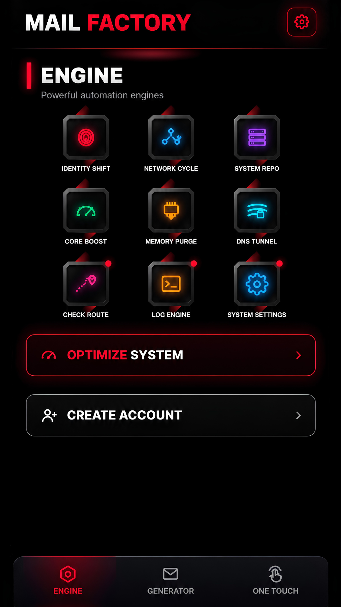
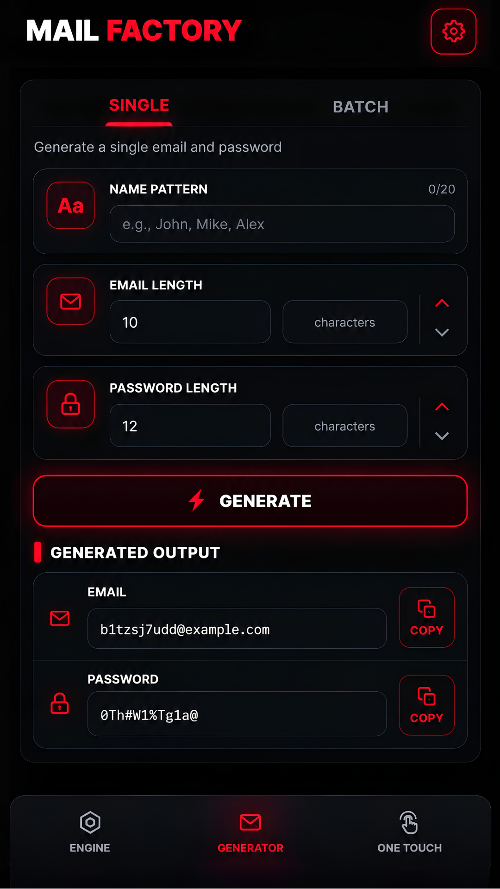
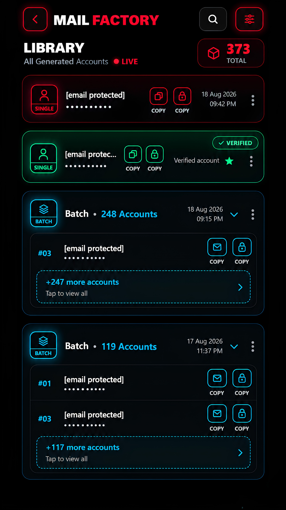
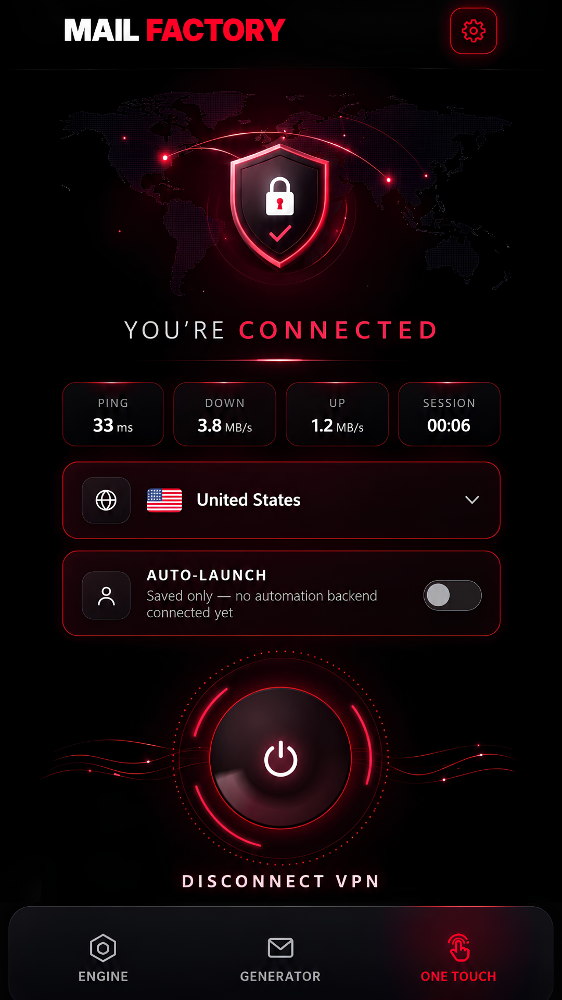
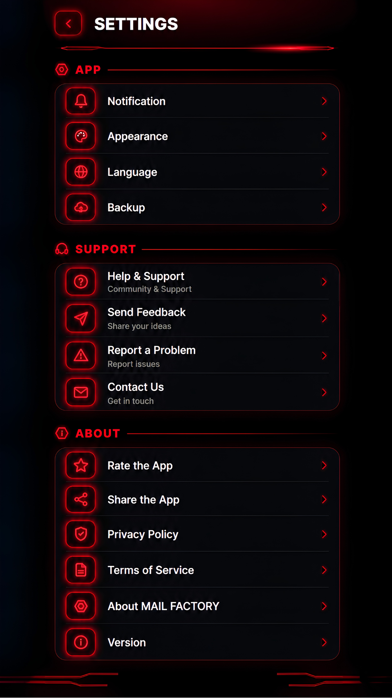

<div align="center">

<a href="https://atawurrahmantanvir.github.io/Mail-Factory/">

</a>

<br><br>

# MAIL FACTORY

### YOUR DIGITAL FREEDOM

**Generate emails. Create strong passwords. Manage & organize — all in one powerful app.**

<br>

<a href="https://atawurrahmantanvir.github.io/Mail-Factory/">

</a>
&nbsp;
<a href="https://github.com/AtawurRahmanTanvir/Mail-Factory">

</a>

</div>

---

<div align="center">

## THE APP

**One application. Six focused surfaces.**

</div>

<br>

<div align="center">

<table border="0">
<tr>
<td align="center"><br><sub><strong>DASHBOARD</strong></sub></td>
<td align="center"><br><sub><strong>ENGINE</strong></sub></td>
<td align="center"><br><sub><strong>GENERATOR</strong></sub></td>
<td align="center"><br><sub><strong>LIBRARY</strong></sub></td>
<td align="center"><br><sub><strong>ONE TOUCH</strong></sub></td>
<td align="center"><br><sub><strong>SETTINGS</strong></sub></td>
</tr>
</table>

<sub>Application screens shown exactly from the repository assets.</sub>

</div>

---

## EXPLORE THE FACTORY

<table width="100%" border="0">
<tr>
<td width="33%" valign="top">

### GENERATE

Create individual or batch results from a focused generation workflow.

</td>
<td width="33%" valign="top">

### ORGANIZE

Use the Library to search, sort and manage generated entries.

</td>
<td width="33%" valign="top">

### CONTROL

Move between Engine, One Touch and Settings without leaving the workspace.

</td>
</tr>
</table>

---

<div align="center">

## LIVE 3D EXPERIENCE

<a href="https://atawurrahmantanvir.github.io/Mail-Factory/">

</a>

<br><br>

<sub><code>docs/index.html</code> is the interactive presentation layer.</sub>

</div>

The README intentionally does **not** duplicate the hero banner or replace any application screenshots. The full visual/interactive experience belongs to the live HTML showcase.

---

## GENERATOR

**Single**

Focused controls for creating one generated result with direct copy actions.

**Batch**

Create multiple results in one run with configurable generation values and individual copy controls.

---

## LIBRARY

A dedicated workspace for the generated collection:

`SEARCH` · `SORT` · `COPY` · `STAR` · `VERIFY` · `RENAME` · `DELETE`

---

## INTERFACE LANGUAGE

`BLACK` · `CRIMSON` · `GLOW` · `PRECISION` · `MOTION`

The application uses a dark utility-oriented visual system with crimson accents, glowing edges and compact information density.

---

## PROJECT STRUCTURE

```text
Mail-Factory/
│
├── app/
│
├── docs/
│   ├── index.html
│   ├── assets/
│   │   ├── hero-banner.png
│   │   ├── logo.png
│   │   └── screens/
│   │       ├── dashboard.png
│   │       ├── engine.png
│   │       ├── generator.png
│   │       ├── library.png
│   │       ├── one-touch.png
│   │       └── settings.png
│   │
│   └── source/
│       └── mail-factory.html
│
├── README.md
└── .gitignore
```

---

<div align="center">

<a href="https://atawurrahmantanvir.github.io/Mail-Factory/">

</a>

<br><br>

**MAIL FACTORY**

`GENERATE` · `ORGANIZE` · `CONTROL`

</div>
