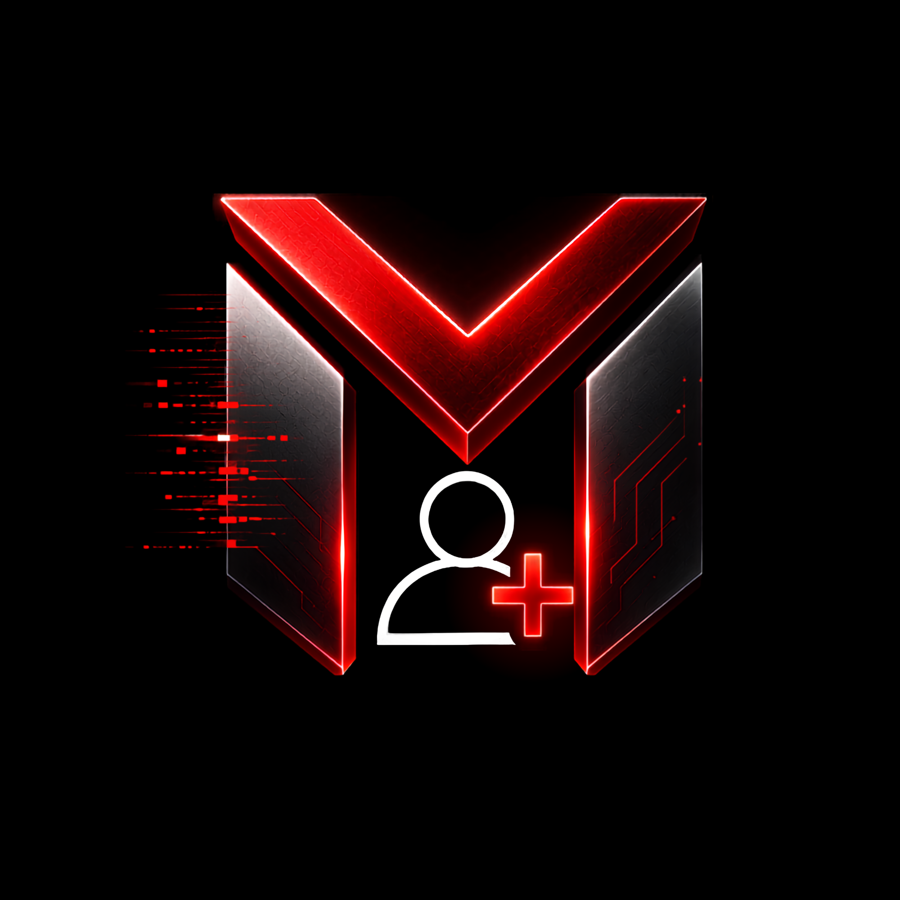

<div align="center">



# MAIL FACTORY

### YOUR DIGITAL FREEDOM

**Generate emails. Create strong passwords. Manage & organize — all in one powerful app.**

<br>


<br><br>

[](https://www.android.com/)
[](https://kotlinlang.org/)
[](https://github.com/AtawurRahmanTanvir/Mail-Factory)

<br>

<a href="https://atawurrahmantanvir.github.io/Mail-Factory/">

</a>

</div>

---

# THE FACTORY

Mail Factory is a local-first Android utility built around fast generation, organization and control.

> **GENERATE → ORGANIZE → CONTROL**

---

# APP EXPERIENCE

## 01 — DASHBOARD


---

## 02 — ENGINE


---

## 03 — GENERATOR


---

## 04 — LIBRARY


---

## 05 — ONE TOUCH


---

## 06 — SETTINGS


---

# CORE FLOW

```text
                         MAIL FACTORY
                              │
                         DASHBOARD
                              │
             ┌────────────────┼────────────────┐
             ▼                ▼                ▼
          ENGINE          GENERATOR        ONE TOUCH
                              │
                       ┌──────┴──────┐
                       ▼             ▼
                     SINGLE        BATCH
                              │
                              ▼
                           LIBRARY
                       ┌──────┼──────┐
                       ▼      ▼      ▼
                    SEARCH   SORT   MANAGE
```

---

# FEATURE MATRIX

| Surface | Purpose |
|---|---|
| **Dashboard** | Central application command surface |
| **Engine** | Generation and utility controls |
| **Generator** | Single and batch generation |
| **Library** | Search, sort and manage entries |
| **One Touch** | Fast access to common actions |
| **Settings** | Application configuration and support |

---

# DESIGN LANGUAGE

<div align="center">


</div>

`BLACK SURFACES` · `CRIMSON ENERGY` · `GLOWING EDGES` · `SCAN MOTION` · `SYSTEM TELEMETRY`

---

# LIVE EXPERIENCE

The repository contains a dedicated cinematic web experience built from the Mail Factory visual system.

<div align="center">

<a href="https://atawurrahmantanvir.github.io/Mail-Factory/">

</a>

</div>

---

# PROJECT STRUCTURE

```text
Mail-Factory/
│
├── app/
│   └── Android application
│
├── docs/
│   ├── index.html
│   ├── assets/
│   │   ├── hero-banner.png
│   │   ├── logo.png
│   │   └── screens/
│   │       ├── dashboard.png
│   │       ├── engine.png
│   │       ├── generator.png
│   │       ├── library.png
│   │       ├── one-touch.png
│   │       └── settings.png
│   │
│   └── source/
│
├── README.md
└── .gitignore
```

---

# RESPONSIBLE USE

Mail Factory should only be used for lawful, authorized and legitimate purposes.

---

<div align="center">

**MAIL FACTORY**

`GENERATE · ORGANIZE · STAY IN CONTROL`

<br>

<a href="https://github.com/AtawurRahmanTanvir/Mail-Factory">

</a>

</div>
